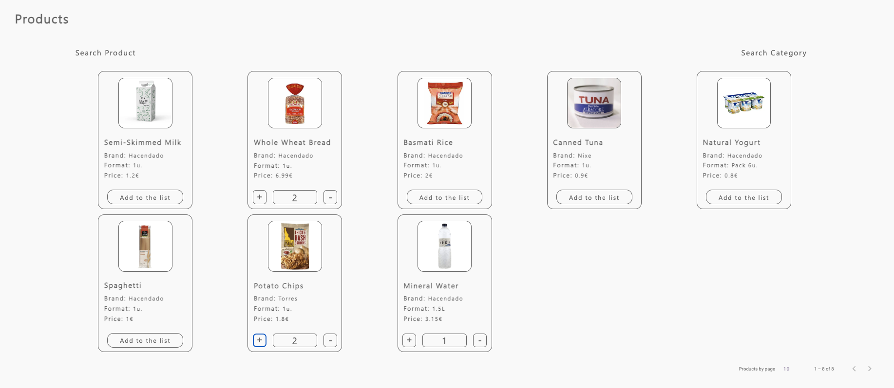

# Shopping-List
On this project, we will create a shopping list app. You have the different products to select your list and after you will check the products.

- [Shopping-List](#shopping-list)
    - [Deploy 🔥](#deploy-)
    - [Installation 🚀](#installation-)
    - [Functionalities ⚙️](#functionalities-️)
        - [Products Page](#products-page)
        - [List Page](#list-page)
    - [Build with 🔨](#build-with-)
    - [Author 👑](#author-)

### Deploy 🔥
```
https://shopping-list-pr9v.onrender.com
```
### Installation 🚀

Clon the repository
```
git clone https://github.com/Rafael3994/Shopping-List.git
```
Go the project folder and install the dependencies.
```
cd Shopping-List

## npm:
npm install 
```
Start the project.
```
npm run dev
```
```
http://localhost:4200/
```

### Functionalities ⚙️
In this section, we explain how to use of the app.
There are two pages in the app, the products page and the list page.

<small>
On the left side, you'll see the sidenav. You can navigate between the pages and clip the options for you will see the different languages.
</small>

<div align="center">
    
</div>

##### Products Page
<small>
On this page you can see the products and select the units that you want to buy. At the top of the list you can search the products by name or category.
On the bottom you can configure the pagination.
</small>

<div align="center">
    
</div>

<div align="center">
    
</div>

##### List Page
<small>
Here you can see the products that you have added to your shopping list and the amount. You can also delete, edit, see the details and check the products. On the left you have an input to search the products more faster.
</small>
<div align="center">
    
</div>
<div align="center">
    
</div>
<div align="center">
    
</div>
<div align="center">
    
</div>

<small>
When you complete the list, you can reset it or clean it.
</small>
<div align="center">
    
</div>

### Build with 🔨
* [Node.js](https://nodejs.org/es/) - Runtime
* [Typescript](https://www.typescriptlang.org/) - Programming Language
* [Angular](https://angular.dev/) - Framework Frontend
* [Ngrx](https://ngrx.io/) - State Management Library
* [Angular material](https://material.angular.io/) - Material Design components for Angular
* [Ngx-translate](https://ngx-translate.org/) - Localization Library for Angular

  
### Author 👑
Rafael Garcia Perez
[GitHub - Rafael3994](https://github.com/Rafael3994)
[Linkedin - Rafael3994](https://www.linkedin.com/in/rafael3994/)